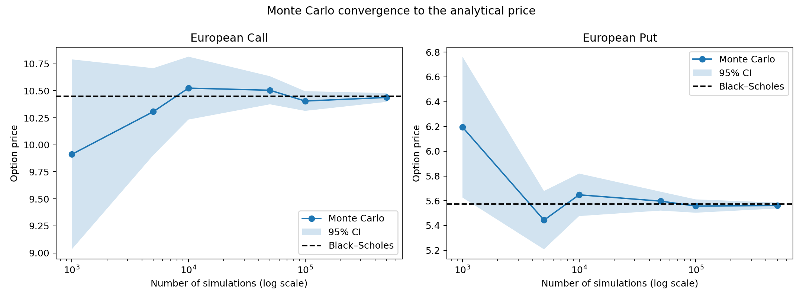
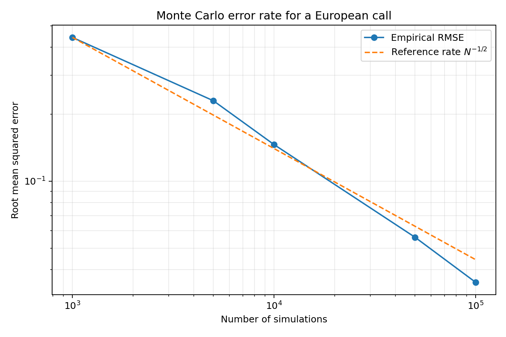

# Monte Carlo Simulation for European Option Pricing

A reproducible Python project for pricing European call and put options under
the Black--Scholes model. It connects geometric Brownian motion (GBM),
risk-neutral valuation, Monte Carlo estimation, confidence intervals, and the
analytical Black--Scholes formula.

## Project objectives

- Simulate stock prices under the risk-neutral GBM model.
- Estimate European call and put prices by Monte Carlo simulation.
- Quantify sampling uncertainty with standard errors and 95% confidence
  intervals.
- Compare numerical estimates with Black--Scholes analytical prices.
- Examine the theoretical Monte Carlo convergence rate
  \(\mathcal{O}(N^{-1/2})\).
- Demonstrate antithetic variates as a simple variance-reduction method.

## Mathematical model

Under the risk-neutral probability measure \(\mathbb{Q}\), a
non-dividend-paying stock follows

$$
dS_t = rS_t\,dt + \sigma S_t\,dW_t,
$$

where \(r\) is the continuously compounded risk-free rate, \(\sigma\) is the
volatility, and \(W_t\) is a Brownian motion. The exact terminal solution is

$$
S_T = S_0\exp\left[\left(r-\frac{1}{2}\sigma^2\right)T
 \sigma\sqrt{T}Z\right], \qquad Z\sim N(0,1).
$$

For a payoff \(H(S_T)\), the no-arbitrage price is

$$
V_0 = e^{-rT}\mathbb{E}^{\mathbb{Q}}[H(S_T)].
$$

The Monte Carlo estimator based on \(N\) independent samples is

$$
\widehat V_N = e^{-rT}\frac{1}{N}\sum_{i=1}^{N}H(S_T^{(i)}).
$$

Its standard error decreases at rate \(N^{-1/2}\). This is why reducing error
by a factor of ten requires approximately one hundred times as many
simulations.

## Baseline experiment

The reproducible experiment uses:

| Parameter | Value |
| --- | ---: |
| Initial stock price \(S_0\) | 100 |
| Strike price \(K\) | 100 |
| Maturity \(T\) | 1 year |
| Risk-free rate \(r\) | 5% |
| Volatility \(\sigma\) | 20% |

With these parameters, the analytical Black--Scholes prices are approximately
**10.4506** for the call and **5.5735** for the put.

## Results

Using 500,000 simulations and seed 2026:

| Option | Monte Carlo | Black--Scholes | Standard error | 95% confidence interval |
| --- | ---: | ---: | ---: | ---: |
| Call | 10.4531 | 10.4506 | 0.0208 | [10.4123, 10.4939] |
| Put | 5.5731 | 5.5735 | 0.0122 | [5.5491, 5.5970] |

Both analytical prices fall inside their corresponding Monte Carlo confidence
intervals.





## Repository structure

```text
.
├── notebooks/
│   └── monte_carlo_option_pricing.ipynb
├── results/
│   ├── convergence_results.csv
│   └── figures/
├── src/
│   └── option_pricing/
│       ├── __init__.py
│       └── pricing.py
├── tests/
│   └── test_pricing.py
├── run_experiments.py
├── requirements.txt
└── README.md
```

## Installation and usage

Create and activate a virtual environment, then install the dependencies:

```bash
python -m venv .venv
```

On macOS or Linux:

```bash
source .venv/bin/activate
```

On Windows PowerShell:

```powershell
.venv\Scripts\Activate.ps1
```

Install and run:

```bash
pip install -r requirements.txt
python run_experiments.py
python -m unittest discover -s tests -v
jupyter notebook notebooks/monte_carlo_option_pricing.ipynb
```

The experiment script regenerates the CSV file and every figure under
`results/`.

## Main findings

- Monte Carlo estimates approach the Black--Scholes benchmark as the number of
  simulations increases.
- A 95% confidence interval makes the estimator's sampling uncertainty
  explicit; a single point estimate alone can be misleading.
- Empirical root mean squared error follows the theoretical
  \(N^{-1/2}\) reference rate.
- Full paths are useful for visualization, but a European option depends only
  on \(S_T\), so direct terminal-price simulation is faster and exact under GBM.

## Assumptions and limitations

The Black--Scholes framework assumes constant volatility and interest rates,
continuous trading, no transaction costs, a liquid market, and lognormally
distributed stock prices. Real markets exhibit volatility smiles, jumps,
changing parameters, liquidity constraints, and other effects that this
baseline model does not capture.

Possible extensions include Greeks by finite differences or pathwise methods,
quasi-Monte Carlo sampling, stochastic volatility, barrier or Asian options,
and calibration to market data.

## Author

Vũ Trịnh — mathematics student interested in stochastic analysis,
optimal control, and quantitative finance.

## License

[MIT](https://choosealicense.com/licenses/mit/)